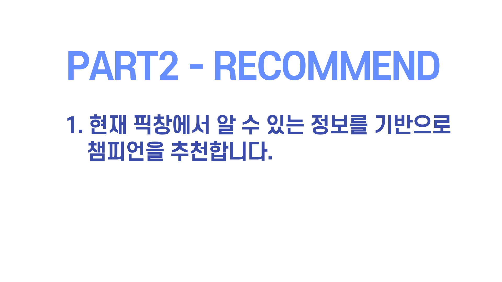
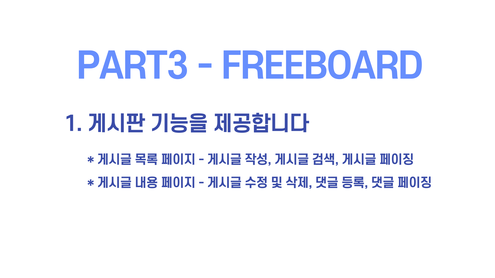

---


---


---


---


---


---



---


---



---


---


---


---


---


---


---


---


---


# BottomOfLegend - AllWinrate

일지

#### 2021/01/09

> freeBoard 수정
>
> 1. freeBoard.html(글 목록)에 글쓰기 버튼 추가
> 2. freeBoardArticle.html(글 상세)에 글 목록으로 가기 버튼 추가


## CLASS 설명


### 컨트롤러

---------

#### AllWinrateController.class

> 컨트롤러
>
> | urlpattern | 기능                       | return(String->html) |
> | ---------- | -------------------------- | -------------------- |
> | /awrmain   | 승률 상위 조합 리스트 출력 | awrMain.html         |
>
> 

​	

#### FreeBoardController.class

> 컨트롤러
>
> 기본 requestmapping: /free_board/*
>
> | urlpattern          | 기능                                                         | Model                                      | return                     |
> | ------------------- | ------------------------------------------------------------ | ------------------------------------------ | -------------------------- |
> | /list(Get)          | 게시글 전체 조회                                             | AllWinrateList<AllWinrate>                 | "freeBoard"                |
> | /{bno}/update(Get)  | 수정창으로 이동                                              | "freeBoard" bno로 찾은 FreeBoard 객체      | "updateFreeBoard"          |
> | /{bno}/update(Post) | updateFreeBoard의 form에서 FreeBoard 필드 받아오고 해당 정보로 글 수정 후 글 상세로 이동 | redirectAttributes.addAttribute("bno",bno) | redirect:/free_board/{bno} |
>
> 


------


### 도메인

----

#### AllWinrate.class

> 조합별 총전적 vo 
>
> ``` java
> String bot_combi; //봇 조합
> String adc; 
> String sup;
> 
> //영문 원딜서폿은 캐릭터 그림 가져올 때 필요
> String engAdc;
> String engSup;
> int whole;
> int win;
> int lose;
> float win_rate;
> ```
>
> #splitCombi
>
> ``` java
> //조합을 원딜과 서폿으로 분류하는 메소드
> //AllWinrate.class 생성자에서 호출하여 사용
> 
> //input: {adc}_{sup}_ver_sion ex)이즈리얼_소나_11_24
> //return: void, AllWinrate 인스턴스에 adc, sup 배정
> 
> public void splitCombi(String bot_combi){
>     String[] combiList = bot_combi.split("_");
>     adc=combiList[0];
>     sup=combiList[1];
> }
> ```


#### FreeBoard

> 자유게시판
>
> ```
>    /*
>    #자유게시판 생성
>    CREATE TABLE tbl_free_board(
>    bno INT NOT NULL AUTO_INCREMENT, -- 게시글 번호
> title VARCHAR(50) NOT NULL, -- 제목
>    content TEXT NOT NULL, --내용
>    writer VARCHAR(30) NOT NULL, --작성자
>    regDate TIMESTAMP DEFAULT NOW(), --작성시간
>    viewCnt INT DEFAULT 0, -- 조회수
>    PRIMARY KEY(bno) -- 기본키 = 게시글번호
> );
>    */
> 
>    private int bno;
>    private String title;
>    private String content;
>    private String writer;
>    private Date regDate;
>    private int viewCnt;
> ```

---


### 롤 세팅 관련

---

#### LolSetting.interface

> 역할1. 사용할 게임 버전, 티어 등 설정 변수를 지정
>
> 역할2. 각종 롤 관련 자료 ex)한글챔프명 -> 영문챔프명
>
> LolSettingImpl.class에서 구현
>
> ```java
> String convertKoToEng(String korChamp) throws IOException; //한글챔프명 -> 영문챔프명
> Map<String,String> koToEngMap() throws IOException; // Map<한글챔프명,영문챔프명>
> ```


### Mapper

---

#### AllWinrateMapper.interface

> sql mapper
>
> | 메소드          | 기능            | sql                          | 반환형          |
> | --------------- | --------------- | ---------------------------- | --------------- |
> | freeBoardList() | 조합별 총전적표 | select * from tbl_free_board | List<FreeBoard> |


#### FreeBoardMapper.interface

>| 메소드                                                       | 기능                                                  | 반환형                                           | 비고                                |
>| ------------------------------------------------------------ | ----------------------------------------------------- | ------------------------------------------------ | ----------------------------------- |
>| freeBoardList()                                              | 모든 게시글 리스트 작성                               | List<FreeBoard>                                  |                                     |
>| tblExist(@Param("DBName") String DBName, @Param("tableName") String tableName) | db(String DBName)에 table(String tableName) 있나 확인 | int(있으면1 없으면0)                             |                                     |
>| getMaxBno()                                                  | 최신글 번호 조회                                      | int                                              | 글 없는 경우는 고려하지 않았음      |
>| findByBno(@Param("bno") int bno)                             | 글번호(int bno)로 글 객체 조회                        | FreeBoard                                        |                                     |
>| save(@Param("title") String title,          @Param("content") String content,          @Param("writer") String writer) | tbl_free_board에 글 저장                              | int(저장된 행 수만큼 리턴한다는데 1만 리턴될듯?) | 글번호, 작성시간, 조회수는 자동생성 |
>| freeBoardUpdate(@Param("titleSql") String title,                              @Param("contentSql") String content,                              @Param("writerSql") String writer,                              @Param("bnoSql") int bno); | 글번호(int bno)에 해당하는 글 정보 업데이트           | Boolean(성공시 1 실패시 0)                       |                                     |
>
>


---

### 서비스


#### AllWinrateService.interface

> allWinrate 페이지 service
>
> AllWinrateServiceImpl 에서 구현
>
> 
>
> ```java
> //db에서 조합별 총승률 리스트 가져옴
> List<AllWinrate> mkAllWinrateList(int minPansoo, int lenList) throws IOException;
> ```
>
> | 메소드                                             | 기능                 | 인자                                                         | 반환형           |
> | -------------------------------------------------- | -------------------- | ------------------------------------------------------------ | ---------------- |
> | mkAllWinrateList<br />(int minPansoo, int lenList) | 조합별 총승률 리스트 | #minpansoo 이상 등장한 조합만 나옴<br />#lenList:  반환할 리스트의 길이 | List<AllWinrate> |
>
> 


#### FreeBoardService.interface

> 자유게시판 service
>
> FreeBoardServiceImpl에서 구현
>
> 
> 
>
> | 메소드          | 기능                         | 인자              | 반환형                |
> | --------------- | ---------------------------- | ----------------- | --------------------- |
> | freeBoardList() | 모든 게시글 리스트           |                   | List<FreeBoard>       |
> | isTblExist      | dBName에 tableName 있나 확인 | dBName, tableName | int(있으면1, 없으면0) |
>
> 


#### AllWinrateConfig.class

> Spring bean 관리


### VIew

---

| filename              | 역할         | 주요 모델 및 역할                | 주요태그 및 역할 |
| --------------------- | ------------ | -------------------------------- | ---------------- |
| freeBoard.html        | 자게 글목록  | allWinrateList(List<AllWinrate>) |                  |
| freeBoardArticle.html | 자게 글 상세 |                                  |                  |
| updateFreeBoard       | 자게 글 수정 | freeBoard - 수정하고싶은 글 객체 |                  |


### ERROR

---

Mapper 테스트 중에 table not found(Cause: org.h2.jdbc.JdbcSQLSyntaxErrorException: Table "TBL_FREE_BOARD" not found; SQL statement:)

junit5로 mybatis mariadb 테스트 중에 반복적으로 발생함.

원인:


sql Mapper 사용시 sql문에 ''안들어가는 오류

ex) select * from table where col1=**col1value** << 이런식으로  sql문에 따옴표 없이 들어감

원인: Mapper에서 Annotation에 parameter 넣을 때 #{}을 써야하는데 ${}써서

(${}는 따옴표 처리 직접 해줘야함)


